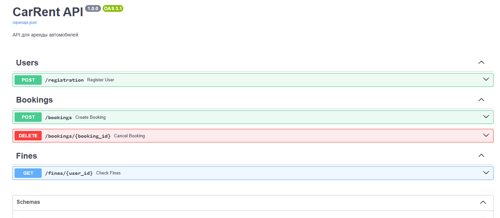

# API для бронирования автомобилей

## Описание

Сервис для бронирования автомобилей. Была разработана спецификация и код к ней.

### Endpoints

- **Регистрация** — создается новыый пользователь
- **Бронирование автомобиля** — возможность забронировать автомобиль
- **Отмена бронирования** — отказ от бронирования
- **Просмотр штрафов** — возможность просмотреть штрафы пользователя

## Swagger

Просмотр swagger возможен по адресу http://127.0.0.1:8000.


## Старт

Потребуются  следующие технологии:

- Python 3.12 и выше
- Docker (опционально)

### Запуск локально

```bash
git clone https://github.com/ValeBlok/api-first-car-rent.git
cd car_rent_api
uvicorn main:app --reload
```

### Запуск в докере

```bash
git clone https://github.com/ValeBlok/api-first-car-rent.git
docker build -t car-rent-api . && docker run -p 8000:8000 car-rent-api
```
